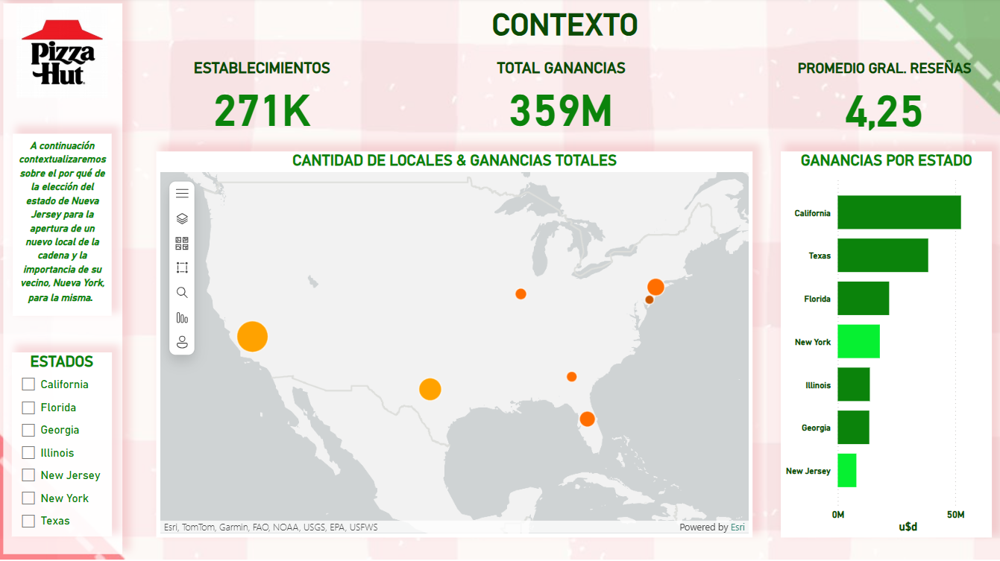
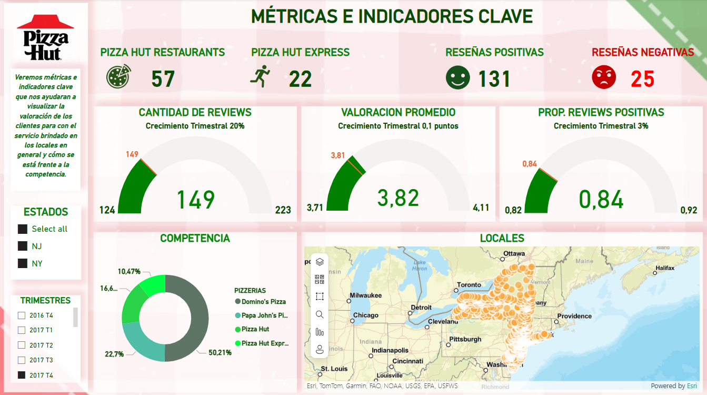

# Análisis de Sentimientos y Dashboard para Optimización de Ubicación de Pizzería en New Jersey/New York


## Descripción del proyecto

Este proyecto tiene como objetivo identificar la mejor ubicación para la apertura de un restaurante de pizzas en la ciudad de New York y en las inmediaciones del MetLife Stadium, en New Jersey, para nuestro cliente Pizza Hut.  

Para ello, se desarrollaron dos modelos de Machine Learning:  
- Un **sistema de recomendación**, que sugiere tres establecimientos cercanos a los clientes potenciales.  
- Un **modelo de análisis de sentimientos**, basado en reseñas previas de los usuarios, para evaluar la percepción de los consumidores sobre distintos restaurantes.  

Además, se diseñó un **dashboard interactivo en Power BI** que permite visualizar métricas clave y optimizar la toma de decisiones estratégicas respecto a la ubicación de nuevas pizzerías y reviews dejados por el cliente.  

## Tabla de Contenidos
1. [Introducción](#introducción)
2. [Objetivos del Proyecto](#objetivos-del-proyecto)
3. [Estructura del Repositorio](#estructura-del-repositorio)
4. [Datos Utilizados](#datos-utilizados)
5. [Tecnologías Utilizadas](#tecnologías-utilizadas)
6. [KPIs](#kpis)
7. [Exploración de Datos (EDA) y Hallazgos Preliminares](#exploración-de-datos-eda-y-hallazgos-preliminares)
8. [Diccionario de Datos](#diccionario-de-datos)
9. [Modelo Entidad-Relación](#modelo-entidad-relación)
10. [Pipeline y ETL Automatizado](#pipeline-y-etl-automatizado)
11. [Dashboard](#dashboard)
12. [Modelos Machine Learning](#modelos-machine-learning) 
13. [Conclusión](#conclusión)
14. [Autores y Contacto](#autores-y-contacto)

## Introducción  

En 2026, Estados Unidos, junto a México y Canadá, será anfitrión de la Copa del Mundo de la FIFA, un evento global que atraerá a más de 3 millones de espectadores y alcanzará una audiencia televisiva de aproximadamente 3.5 mil millones de personas (fuente: FIFA). Entre los estadios seleccionados, el MetLife Stadium, con una capacidad de 82,500 espectadores, será sede de siete partidos, incluyendo cuatro de la fase de grupos, uno de dieciseisavos de final, uno de cuartos de final y, sobre todo, la gran final del torneo.  

Este proyecto tiene como objetivo identificar la mejor ubicación en las inmediaciones del estadio para la apertura de un restaurante de pizzas. Además, según el último censo de Estados Unidos, Nueva York ocupa el cuarto lugar entre los estados con mayores ingresos generados por restaurantes de servicio limitado, mientras que New Jersey se encuentra dentro del Top 15 en este sector, lo que refuerza la viabilidad de esta inversión.  

## Objetivos del Proyecto

- Recomendar una ubicación para la apertura de un nuevo restaurante de pizza en el estado de New Jersey, en las inmediaciones del Metlife Stadium, o en la ciudad de New York.

- Crear un Dashboard en Power BI que permita visualizar KPIs relacionados con las reviews plasmadas en Google Maps y las puntuaciones de la experiencia de los clientes.

- Crear un sistema de recomendación de restaurante para los clientes en la zona de New Jersey.

## Estructura del Repositorio <!-- Revisar si se debe actualizar -->
El repositorio está organizado de la siguiente manera:
```
📂 Proyecto-Final
│── 📂 .devcontainer    # Configuración para entornos de desarrollo en contenedores
│── 📂 Assets           # Imágenes y recursos gráficos para documentación y dashboard
│── 📂 Datos            # Datos sin procesar y procesados
│── 📂 EDA              # Notebooks y scripts de análisis exploratorio de datos
│── 📂 Modelos ML       # Modelos de machine learning y scripts relacionados
│── .gitignore          # Archivos y carpetas que Git debe ignorar
│── README.md           # Documentación principal del proyecto
│── recommender.py      # Script del sistema de recomendación
│── requirements.txt    # Lista de dependencias necesarias para ejecutar el proyecto
```

## Datos Utilizados  

Los datos empleados han sido extraídos de las siguientes fuentes:  

- **Google Maps:** Se utilizó para extraer información sobre establecimientos de pizza en las áreas de interés, incluyendo calificaciones, reseñas de usuarios y ubicación geográfica.  

- **API del Censo de EE.UU. (2022):** Proporciona datos demográficos y económicos relevantes de New Jersey y New York, permitiendo un análisis detallado del entorno comercial y la demanda potencial en estas zonas.  

- **Yelp:** Si bien se cuenta con una base de datos de reseñas de usuarios de Yelp, se decidió no utilizarla debido a su escasa o nula información relevante sobre los estados de New Jersey y New York, que son los de interés para nuestro cliente, Pizza Hut.  

## Tecnologías Utilizadas  

Para este proyecto, elegimos un stack tecnológico basado en **AWS**, ya que ofrece escalabilidad, automatización y optimización de costos sin necesidad de gestionar infraestructura propia.  

- **Almacenamiento de datos:** Los datasets de Google Maps y la API del Censo se almacenan en **Amazon S3** en formatos JSON y Parquet, lo que permite manejar grandes volúmenes de datos de manera eficiente y reducir costos de almacenamiento.  

- **Procesamiento ETL:** Se utiliza **AWS Lambda** para ejecutar procesos de extracción, transformación y carga (ETL), integrando datos de distintas fuentes y preparándolos para su almacenamiento y análisis.  

- **Data Warehouse:**  
  - Se implementará un **Data Warehouse en Amazon RDS**, diseñado para optimizar el almacenamiento y análisis de datos estructurados.  
  - Este Data Warehouse permitirá ejecutar consultas SQL de manera eficiente, facilitando el acceso a información clave para la toma de decisiones.  
  - Su arquitectura garantizará integridad y escalabilidad, asegurando tiempos de respuesta rápidos para consultas analíticas.  

- **Automatización del pipeline:** **AWS Lambda** también se encarga de la orquestación de los flujos de trabajo, asegurando la ejecución eficiente y sin intervención manual de los procesos de ingesta y transformación de datos.  

- **Análisis de Datos y Machine Learning:**  
  - **Pandas y NumPy** para análisis exploratorio de datos.  
  - **Scikit-learn** para modelos predictivos y análisis de sentimientos basados en reseñas de usuarios.  
  - **spaCy** para procesamiento de lenguaje natural.  

- **Visualización y Despliegue:**  
  - **Power BI** para la creación de dashboards interactivos que faciliten la toma de decisiones basada en datos.  
  - **Streamlit** para desarrollar aplicaciones dinámicas y accesibles, proporcionando una interfaz intuitiva para el análisis de resultados.  

Este stack tecnológico permite un flujo de datos completamente automatizado, optimizando la ingesta, transformación, almacenamiento y análisis, garantizando eficiencia y escalabilidad en la nube.   


## KPIs

Se emplearán 3 KPIs principales para evaluar el éxito del proyecto:

1. Crecimiento trimestral de 2% en el número de reviews para la cadena en los estados estudiados. Su fórmula es la siguiente:

$`KPI = ((Reviews Nuevos - Reviews Actual) / Reviews Actual) * 100`$

2. Incremento trimestral de 0.1 puntos en la valoración de los establecimientos en los estados de New York y New Jersey. Su fórmula es la siguiente:

$`KPI = Valoración Nueva - Valoración Actual`$

3. Aumentar la proporción trimestral de comentarios positivos en 3% de los establecimientos. Su fórmula es la siguiente:

$`KPI = (((Comentarios Positivos Nuevos- Comentarios Negativos Nuevos) - (Comentarios Positivos Actuales - Comentarios Negativos Actuales))/ (Comentarios Positivos Actuales - Comentarios Negativos Actuales)) * 100`$


## Exploración de Datos (EDA) y Hallazgos Preliminares

- El promedio de calificaciones para las pizzerías de los estados de New Jersey y New York es de 4.11. El rango de calificación se encuentra entre 1 y 5, siendo 1 muy malo y 5 muy bueno.

- Los locales tienen en promedio 89.9 reviews cada uno. El que tiene más reviews cuenta con 4,362.

- Pizza Hut, la cadena en que se enfoca este proyecto, tiene un promedio de calificación de 3.3 en New Jersey y 3.7 en New York.

- A continuación, se puede observar la relación entre la cantidad de reviews en Google Map y el promedio de calificaciones, destacando que a mayor número de reviews menor es el número de calificaciones.


## Diccionario de Datos

### Tabla Census
Datos provenientes de API

| Columna     | Tipo de dato  | Acepta nulos | Descripción |
|------------|-------------|--------------|-------------|
| year       | int         | No           | Año en que se realizó el censo |
| state      | int         | No           | Código del estado al que corresponden los datos |
| name       | char(50)    | Sí           | Nombre del estado |
| sector_cod | int         | Sí           | Código del sector de la industria correspondiente a "Restaurants" |
| sector     | char(20)    | Sí           | Nombre del sector de la industria correspondiente a "Restaurants" |
| rcptot     | bigint      | Sí           | Importe de ventas o ganancias del sector (en miles de dólares) |
| emp        | bigint      | Sí           | Cantidad de empleados |
| estab      | bigint      | Sí           | Cantidad de establecimientos |


### Tabla gm_reviews
Datos de Reviews Google Maps

| Columna   | Tipo de dato  | Acepta nulos | Descripción |
|-----------|-------------|--------------|-------------|
| gmap_id   | char(50)    | No           | Identificador único en Google Maps para el establecimiento |
| user_id   | double      | No           | Identificador único del usuario que publicó la reseña |
| date_rev  | datetime(3) | No           | Fecha y hora en que se realizó la reseña |
| rating    | tinyint     | No           | Calificación del usuario (valores entre 1 y 5) |
| text_rev  | text        | Sí           | Comentario opcional que publicó el usuario sobre el establecimiento |


### Tabla gm_sitios
Datos de Sitios Google Maps

| Columna         | Tipo de dato  | Acepta nulos | Descripción |
|----------------|-------------|--------------|-------------|
| gmap_id       | char(50)    | No           | Identificador único de Google Maps |
| name          | char(100)   | No           | Nombre del establecimiento |
| street_address| char(100)   | Sí           | Calle y número de la ubicación |
| city          | char(50)    | No           | Ciudad donde se encuentra el establecimiento |
| state         | char(2)     | No           | Estado (NJ o NY) |
| zip_code      | smallint    | No           | Código postal del establecimiento |
| latitude      | float       | No           | Latitud geográfica |
| longitude     | float       | No           | Longitud geográfica |
| avg_rating    | float       | No           | Calificación promedio del establecimiento (1-5) |
| num_of_reviews| smallint    | No           | Número total de reseñas registradas |
| price         | char(5)     | Sí           | Rango de precios ($, $$, $$$) |
| Monday        | char(20)    | Sí           | Horario de atención los días lunes |
| Tuesday       | char(20)    | Sí           | Horario de atención los días martes |
| Wednesday     | char(20)    | Sí           | Horario de atención los días miércoles |
| Thursday      | char(20)    | Sí           | Horario de atención los días jueves |
| Friday        | char(20)    | Sí           | Horario de atención los días viernes |
| Saturday      | char(20)    | Sí           | Horario de atención los días sábados |
| Sunday        | char(20)    | Sí           | Horario de atención los domingos |
| Delivery      | bit         | No           | Indica si el establecimiento ofrece entrega a domicilio (1 = Sí, 0 = No) |
| Dine-in       | bit         | Sí           | Indica si sirven comida para consumir en el local (1 = Sí, 0 = No) |
| Takeout       | bit         | No           | Indica si sirven comida para llevar (1 = Sí, 0 = No) |
| Good_for_kids | bit         | No           | Indica si es apto para niños (1 = Sí, 0 = No) |
| Casual        | bit         | No           | Indica si el ambiente es informal (1 = Sí, 0 = No) |
| Dinner        | bit         | No           | Indica si es un lugar adecuado para cenar (1 = Sí, 0 = No) |
| Lunch         | bit         | Sí           | Indica si es un lugar adecuado para almorzar (1 = Sí, 0 = No) |

## Modelo Entidad-Relación


## Pipeline y ETL Automatizado  

Nuestro **pipeline de datos** está diseñado para operar de manera completamente automatizada, asegurando la actualización y disponibilidad de información en nuestro **Data Warehouse en Amazon RDS**, lo que permite alimentar tanto nuestro **dashboard en Power BI** como nuestros **modelos de Machine Learning**.  

El pipeline se compone de **dos orígenes de datos principales**:  

1. **Google Maps:** Contamos con dos datasets en formato Parquet almacenados en **Amazon S3**, uno con información sobre establecimientos y otro con reseñas de usuarios.  
2. **API del Censo de EE.UU. (2022):** Proporciona datos demográficos y económicos de **New York y New Jersey**, los cuales reciben una transformación mínima antes de ser cargados directamente en **Amazon RDS**.  

Para la ingesta y procesamiento de estos datos, el pipeline se basa en **tres funciones AWS Lambda**, que automatizan la extracción, transformación y carga (ETL) de la información:  

### **1. Función ETL**  
**Activación:** Se ejecuta automáticamente cuando un nuevo dataset es subido a la carpeta **input/** del bucket de **Amazon S3**.  

**Proceso:**  
- Toma el dataset subido (sitios de Google Maps o reseñas de usuarios).  
- Aplica las transformaciones y normalizaciones necesarias.  
- Guarda los datos procesados en la carpeta **output/** dentro del mismo bucket de S3.  

**Uso posterior:**  
- Una vez procesados, los archivos en **output/** serán utilizados por la **Función carga-a-rds** para poblar las tablas del **Data Warehouse en Amazon RDS**.  

### **2. Función Extraccion_censo_ny_nj_2022**  
**Activación:** Programada para ejecutarse **todos los lunes a las 08:00 AM**.  

**Proceso:**  
- Se conecta con la **API del Censo de EE.UU. (2022)**.  
- Aplica una transformación mínima a los datos obtenidos.  
- Carga los datos procesados directamente en el **Data Warehouse en Amazon RDS**.  

### **3. Función carga-a-rds**  
**Activación:** Se ejecuta cuando un nuevo archivo es subido a la carpeta **output/** en **Amazon S3**.  

**Proceso:**  
- Toma los archivos ya transformados y normalizados.  
- Inserta los datos en las tablas relacionales de **Amazon RDS (MySQL)**.  

**Uso posterior:**  
- Las tablas en **Amazon RDS** alimentarán tanto nuestro **dashboard en Power BI** como nuestros **modelos de Machine Learning**, asegurando que trabajen con información actualizada.  

### **Flujo de Datos**  

1. Carga de datos en S3 o consulta a la API del Censo.  
2. La función ETL transforma los datos de Google Maps y los mueve a **output/**.  
3. La función Extraccion_censo_ny_nj_2022 obtiene y carga datos del censo en RDS.  
4. La función carga-a-rds sube los datos procesados a Amazon RDS.  
5. El dashboard en Power BI y los modelos de Machine Learning consumen los datos del Data Warehouse.  

Con este diseño, garantizamos un pipeline de datos **eficiente, escalable y automatizado**, optimizando la ingesta, transformación, almacenamiento y análisis de información.  


## Dashboard

<!-- Meterle fotos del dashboard y poner el storytelling -->

El **dashboard interactivo en Power BI** proporciona un análisis detallado y dinámico sobre el desempeño de los restaurantes Pizza Hut en los estados de **New York (NY) y New Jersey (NJ)**.  
A través de una combinación de visualizaciones, métricas clave y opciones de filtrado, el dashboard permite evaluar la percepción de los clientes, la evolución de las reseñas y la cuota de mercado de la marca en comparación con la competencia.

### **Principales Componentes**  

#### **1. Filtros Interactivos**  
Para facilitar un análisis flexible, el dashboard incluye:  
- **Filtro por estado:** Permite seleccionar y analizar datos de los estados de NY y NJ.  
- **Filtro por trimestre:** Permite evaluar el desempeño en períodos trimestrales.  

#### **2. Indicadores Claves de Rendimiento (KPIs)**  
Los KPIs ofrecen un resumen rápido de los datos más relevantes:  
- **Cantidad de reseñas:** Mide el número total de reseñas en el período y estado seleccionado, comparándolo con el trimestre anterior. *(Objetivo: crecimiento trimestral de 20% o más)*.  
- **Valoración promedio:** Presenta el promedio general de las calificaciones otorgadas por los clientes, comparándolo con el período anterior. *(Objetivo: incremento trimestral mínimo de 0.1 puntos)*.  
- **Proporción de reseñas positivas:** Muestra el porcentaje de reseñas con una calificación de 3 estrellas o más sobre el total recibido en el período y estado seleccionado. *(Objetivo: aumento trimestral de 3% o más)*.  

#### **3. Tarjetas de Resumen**  
Incluyen datos clave sobre la presencia y reputación de los restaurantes:  
- **Total de restaurantes:** Cantidad total de establecimientos de Pizza Hut en NY y NJ.  
- **Cantidad de restaurantes Express:** Número de locales de tipo Express.  
- **Cantidad de reseñas positivas:** Total de comentarios con calificación de 3 estrellas o más.  
- **Cantidad de reseñas negativas:** Total de comentarios con calificación de 1 o 2 estrellas.  

#### **4. Análisis de Cuota de Mercado**  
Un **gráfico de anillo** permite visualizar la cuota de mercado de Pizza Hut en comparación con otras cadenas de pizza como **Domino’s, Papa John’s y Little Caesars**, proporcionando un análisis competitivo de la marca en los estados seleccionados.  

#### **5. Mapa de Ubicación de Restaurantes**  
Un **mapa interactivo** representa la distribución geográfica de los restaurantes Pizza Hut en **Nueva York y Nueva Jersey**, permitiendo identificar zonas estratégicas para la apertura de nuevos locales.  




<!-- 
---

### **Conclusión**  
El dashboard en Power BI es una herramienta esencial para la **toma de decisiones estratégicas**, ya que facilita el monitoreo del desempeño de los restaurantes, la evaluación de la satisfacción del cliente y el análisis de la cuota de mercado.  
Gracias a la combinación de **filtros interactivos, KPIs y visualizaciones dinámicas**, permite una gestión basada en datos que contribuye a mejorar la experiencia del cliente y optimizar la presencia de Pizza Hut en la región.  

---
-->

## Modelos de Machine Learning

### 1. Análisis de sentimientos con VADER

Este módulo realiza un análisis de sentimientos utilizando **VADER Sentiment Analyzer**, un modelo basado en reglas diseñado para evaluar el tono emocional de textos cortos.

#### Modelo Utilizado

- **VADER Sentiment Analyzer**: Evalúa la polaridad del texto (positivo, negativo o neutro) a partir de puntuaciones predefinidas.
- **TF-IDF Vectorizer**: Convierte el texto en representaciones numéricas para posibles análisis adicionales.

#### Proceso

1. **Carga de Datos**: Se lee un archivo **Parquet** con comentarios de usuarios.
2. **Preprocesamiento**: Se eliminan valores nulos en la columna **text**.
3. **Análisis de Sentimiento**:
   - Se obtiene la puntuación de sentimiento (**compound**) con VADER.
   - Se categorizan los comentarios como **positivo**, **negativo** o **neutro**.

#### Ejemplo de Resultados

Un usuario escribe el texto:

"we had a great day. The pizza was delicious."

Por lo que el modelo responde con el sentimiento del comentario en formato JSON de la siguiente manera:

```
{
  "sentimiento": "positivo"
}
```

### 2. Sistema de recomendación

#### Sistema de Recomendación de Restaurantes

Este módulo implementa un **sistema de recomendación de restaurantes** utilizando el algoritmo **K-Nearest Neighbors (KNN)** para encontrar lugares similares en base a características preprocesadas.

#### Modelo Utilizado

- **K-Nearest Neighbors (KNN)**: Encuentra restaurantes similares basándose en distancias en un espacio vectorial.
- **FastAPI**: Se utiliza para exponer el sistema de recomendación como un servicio API.
- **Joblib**: Para guardar y cargar modelos previamente entrenados.

#### Proceso

1. **Carga de Datos**: Se lee un archivo **Parquet** con información de restaurantes.
2. **Preprocesamiento**:
   - Se limpian los datos y se convierten a un formato adecuado.
   - Se extraen características relevantes para el modelo.
3. **Entrenamiento del Modelo**:
   - Se utiliza KNN para encontrar restaurantes similares.
   - Se ajustan los parámetros óptimos según los datos disponibles.
4. **Despliegue con FastAPI**:
   - Se crea un endpoint que recibe datos y devuelve recomendaciones de restaurantes.

#### Ejemplo de Uso

Un usuario solicita recomendaciones enviando una consulta con la información:

* zip_code: 11220
* dia: "Tuesday"
* hora: 16.0

El sistema responderá con una lista de 3 lugares similares que cumplan esas características, en formato JSON, de la siguiente manera:

```
[
  {
    "name": "Charles Pizzeria",
    "street_address": "4910 5th Ave",
    "zip_code": "11220",
    "num_of_reviews": 218,
    "avg_rating": 4.5,
    "mensaje": "El restaurante 'Charles Pizzeria', ubicado en '4910 5th Ave', posee 218.0 comentarios, y el promedio de su puntuación es 4.5."
  },
  {
    "name": "Rax's Pizza",
    "street_address": "4613 5th Ave",
    "zip_code": "11220",
    "num_of_reviews": 28,
    "avg_rating": 4.1,
    "mensaje": "El restaurante 'Rax's Pizza', ubicado en '4613 5th Ave', posee 28.0 comentarios, y el promedio de su puntuación es 4.1."
  },
  {
    "name": "Tony's Pizza",
    "street_address": "6112 4th Ave",
    "zip_code": "11220",
    "num_of_reviews": 28,
    "avg_rating": 3.9,
    "mensaje": "El restaurante 'Tony's Pizza', ubicado en '6112 4th Ave', posee 28.0 comentarios, y el promedio de su puntuación es 3.9."
  }
]
```

## Conclusión

Este proyecto ofrece un enfoque basado en datos para optimizar la ubicación de un nuevo restaurante **Pizza Hut** en las inmediaciones del **MetLife Stadium, en New Jersey**.  
A través del análisis de reseñas, modelos de **Machine Learning** y un **dashboard interactivo**, se facilita la toma de decisiones estratégicas con información clave del mercado.

### **Impacto del Proyecto**  
- **Selección estratégica de ubicaciones:** Identificación de zonas óptimas basadas en demanda y competencia.  
- **Optimización de la experiencia del cliente:** Análisis de reseñas para mejorar la percepción de la marca.  
- **Herramienta de apoyo para ejecutivos:** Dashboard interactivo que permite evaluar datos en tiempo real.  

### **Propuestas para Próximas Versiones**  
- **Monitoreo en tiempo real:** Incorporar actualizaciones dinámicas para ajustar estrategias según las tendencias del mercado.  
- **Expansión del sistema de recomendación:** Ampliar el análisis a otras áreas metropolitanas de alto tráfico.  
- **Mejoras en los modelos de Machine Learning:** Integrar nuevas fuentes de datos para mejorar la precisión de las predicciones.  

Gracias a este análisis, **Pizza Hut** podrá optimizar su estrategia de expansión en **New York y New Jersey**, asegurando decisiones fundamentadas en datos.  

<!--
(Sugerencia chatgpt para sección conclusiones)
Aunque falta completar esta parte, debería incluir:
* Principales hallazgos
* Limitaciones del análisis
* Posibles mejoras futuras
 -->

## Autores y Contacto  

Este proyecto fue desarrollado por el siguiente equipo de profesionales en ciencia de datos e ingeniería:

<!-- Primera fila (3 integrantes) -->
<table align="center">
  <tr>
    <td align="center">
      <br>
      <b>Victoria Riso</b><br>
      Data Analyst / Team Leader<br>
      <a href="https://www.linkedin.com/in/victoria-riso/">🔗 LinkedIn</a> |
      <a href="https://github.com/victoriariso">🐙 GitHub</a>
    </td>
    <td align="center">
      <br>
      <b>Manuel Cozzari</b><br>
      Data Analyst<br>
      <a href="https://www.linkedin.com/in/manuel-cozzari/">🔗 LinkedIn</a> |
      <a href="https://github.com/MCozzari">🐙 GitHub</a>
    </td>
    <td align="center">
      <br>
      <b>Facundo Serqueira</b><br>
      Data Engineer<br>
      <a href="https://www.linkedin.com/in/facundo-nahuel-serqueira-aba554b/">🔗 LinkedIn</a> |
      <a href="https://github.com/nahuelfns">🐙 GitHub</a>
    </td>
  </tr>
</table>

<!-- Segunda fila (2 integrantes) -->
<table align="center">
  <tr>
    <td align="center">
      <br>
      <b>Felipe Viera</b><br>
      Data Engineer<br>
      <a href="https://www.linkedin.com/in/felipe-viera-klein-22b357131/">🔗 LinkedIn</a> |
      <a href="https://github.com/Vierinsky">🐙 GitHub</a>
    </td>
    <td align="center">
      <br>
      <b>Kevin Guarda</b><br>
      Machine Learning Engineer<br>
      <a href="https://www.linkedin.com/in/kevin-guarda/">🔗 LinkedIn</a> |
      <a href="https://github.com/KevGuarda">🐙 GitHub</a>
    </td>
  </tr>
</table>

---
